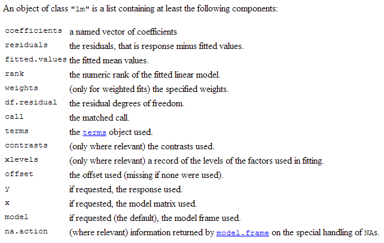

Object Orientation
======================================================
R is an Object-Oriented Language. This is not specific to R - indeed, languages like Python, C++, and many many others support this paradigm. 

The key characteristics to any language with object orientation are 4 fold:
* **Abstraction** 
* **Polymorphism**
* **Encapsulation**
* **Inheritance**

To understand these let us also introduce the terms you will commonly see when discussing OO-principles:
* **Object**
* **Class**
* **Method**

To tie these together - any bit of information in R is an **object**. A **class** defines the behavior of the object and how it relates to other classes. **Methods** are functions that behave differently depending on what class they are acting on. (We'll get to some examples to make this more clear)

R has 3 separate object orientated systems, however, for this workshop our goal is not to dig into the nitty-gritty of each, but rather generally understand how they relate to the concept of object orientation and what it means for our day-to-day R usage.

An **object** has characteristics and properties that describe it - attributes that can describe the state of an object. Objects are independent of one another. They are self-contained. They have behavior. Any easy way to determine if something is an object is if it can be described by nouns. They are not verbs.
- the data frame
- the string
- the number 2

Not:
- print
- run
- get

A **class** can be thought of as a blueprint - a definition and description of a framework or idea that will have specific attributes under certain circumstances. 

A class describes what an object will be. To just as a blueprint may be used to build a house, a class can be used to create objects.

Classes have 3 components
* name/type
* attributes/properties/data
* behaviors/operations

Lets examine the linear model class by these definitions

`? lm()`

You can see in the documentation: 



The linear model class is defining what attributes an object of that class requires. It doesn't give actual values (ie what the coefficient is), but rather it provides the definition.

This class of lm() will allow us to make many linear model objects each that have different values inside that we can manipulate independently.

This interplay between an overarching theoretical class and the objects that can be created helps us understand the concepts of **abstraction** and **encapsulation**.

**Abstraction** - allows us to not have to write a customized set of commands each time we want to fit a linear model - rather we can come up with the core attributes and behaviors that will be relevant for all linear models. eg: x-values, y-values, coefficients, residuals. A key point of abstraction is to only focus on distilling down to the essentials.

**Encapsulation** - This ties in nicely with abstraction - encapsulation is the concept of packaging separate but related items into one class instance. We don't have to individually store the coefficients and residuals, rather we can keep all the relevant components in one place (in this case a list). 

Another key feature of encapsulation is it allows us to to restrict access to individual components inside a class. **black box example** and **changing internal storage** This allows us to reduce dependencies to different parts of the applications. **GIVE EXAMPLE**

We have discussed how classes can be thought of as blueprints. **Inheritance** is the idea that classes can inherit the attributes and behaviors of a parent class while adding whatever stuff specific to the new class. This is importance since, as we mentioned with abstraction, the attributes and behaviors for a class should focus only on the essentials for that situation. Keep in mind *inheritance should be based on similarity of the structure of the object, not similarity for the concepts for the objects*. IE a matrix is a specific type of dataframe but it does not inherit from dataframe as they have completely separate implementations.

**bank account example**
**bank account**
**checking account**
**savings account**

A direct examplwe we frequently use is when we deal with ordered factors. The class "ordered" inherits from the class "factor". This way "ordered" doesn't have to re-invent the wheel, but instead can just add on the necessary tidbits.

This brings us to our last 2 terms - **Methods** and **Polymorphism**

Each OO system in R has a different way of handling methods - but essentially you can think of methods as a function. 


The other concept that is tied tightly to methods is **polymorphism**. Polymorphism means that the same function call (same name) can lead to different operations depending on the class of the object it is acting on.

To demonstrate how methods work and how you would mostly likely use them, we will look at the older (and simplier) S3 system. 

Whenever you use a function on an object - for example `print(Theoph)` or `summarize(df)` you are actually taking advantage of R's polymorphism and the methods tied to the class of the particular object. 

Notice how the summary function gives us useful information for factors or numerics.


```r
summary(chickwts)
```

```
##      weight           feed   
##  Min.   :108   casein   :12  
##  1st Qu.:204   horsebean:10  
##  Median :258   linseed  :12  
##  Mean   :261   meatmeal :11  
##  3rd Qu.:324   soybean  :14  
##  Max.   :423   sunflower:12
```


Summary gracefully handles the numeric weight variable and the factor 'feed' by giving different types of output more relavent to the type of data. 

To do so, S3 uses functions called **generic functions**. A generic function will look for a **method** associated with the class of the object it is being called on. If it finds an associated method (function telling how to handle an object of that class) it will use that method, otherwise it will use a generic implementation that generally works for most scenarios. 

Lets take a look at the generic function `summary` and see what classes that have a specific implementation


```r
methods(summary)
```

```
##  [1] summary.aov             summary.aovlist        
##  [3] summary.aspell*         summary.connection     
##  [5] summary.data.frame      summary.Date           
##  [7] summary.default         summary.ecdf*          
##  [9] summary.factor          summary.glm            
## [11] summary.infl            summary.lm             
## [13] summary.loess*          summary.manova         
## [15] summary.matrix          summary.mlm            
## [17] summary.nls*            summary.packageStatus* 
## [19] summary.PDF_Dictionary* summary.PDF_Stream*    
## [21] summary.POSIXct         summary.POSIXlt        
## [23] summary.ppr*            summary.prcomp*        
## [25] summary.princomp*       summary.proc_time      
## [27] summary.srcfile         summary.srcref         
## [29] summary.stepfun         summary.stl*           
## [31] summary.table           summary.tukeysmooth*   
## 
##    Non-visible functions are asterisked
```


Imagine having to type summary.<class-of-your-object> every time you wanted to get a summary. Polymorphism and Object Orientation give us this flexibility.

Likewise, lets wee what kinds of methods are available for certain a certain class


```r
methods(class = "data.frame")
```

```
##  [1] $<-.data.frame           [.data.frame            
##  [3] [[.data.frame            [[<-.data.frame         
##  [5] [<-.data.frame           aggregate.data.frame    
##  [7] anyDuplicated.data.frame as.data.frame.data.frame
##  [9] as.list.data.frame       as.matrix.data.frame    
## [11] by.data.frame            cbind.data.frame        
## [13] dim.data.frame           dimnames.data.frame     
## [15] dimnames<-.data.frame    droplevels.data.frame   
## [17] duplicated.data.frame    edit.data.frame*        
## [19] format.data.frame        formula.data.frame*     
## [21] head.data.frame*         is.na.data.frame        
## [23] Math.data.frame          merge.data.frame        
## [25] na.exclude.data.frame*   na.omit.data.frame*     
## [27] Ops.data.frame           plot.data.frame*        
## [29] print.data.frame         prompt.data.frame*      
## [31] rbind.data.frame         row.names.data.frame    
## [33] row.names<-.data.frame   rowsum.data.frame       
## [35] split.data.frame         split<-.data.frame      
## [37] stack.data.frame*        str.data.frame*         
## [39] subset.data.frame        summary.data.frame      
## [41] Summary.data.frame       t.data.frame            
## [43] tail.data.frame*         transform.data.frame    
## [45] unique.data.frame        unstack.data.frame*     
## [47] within.data.frame       
## 
##    Non-visible functions are asterisked
```


Notice, so many of the functions 'built-in' to R are generic functions that have been given specific instructions for how to handle an object of class `data.frame`. 

As you may have noticed from looking at the summary methods, generic functions can be written to be tied to a specific class via `generic_function.class`

Let's have a go at creating our own method *parametric* and write an associated summary function. We can use the `Theoph` dataset and the `conc` column for this demonstration.


```r
class(Theoph$conc) <- 'parametric'

summary.parametric <- function(x, ...) {
    c(
    mean    = mean(x),
    var     = var(x),
    stdev   = sd(x),
    low_CI  = mean(x) - 1.96*sd(x),
    high_CI = mean(x) + 1.96*sd(x)
    )
}

summary(Theoph$conc)
```

```
##    mean     var   stdev  low_CI high_CI 
##  4.9605  8.2215  2.8673 -0.6595 10.5804
```

```r
summary(Theoph)
```

```
##     Subject         Wt            Dose           Time       
##  6      :11   Min.   :54.6   Min.   :3.10   Min.   : 0.000  
##  7      :11   1st Qu.:63.6   1st Qu.:4.30   1st Qu.: 0.595  
##  8      :11   Median :70.5   Median :4.53   Median : 3.530  
##  11     :11   Mean   :69.6   Mean   :4.63   Mean   : 5.895  
##  3      :11   3rd Qu.:74.4   3rd Qu.:5.04   3rd Qu.: 9.000  
##  2      :11   Max.   :86.4   Max.   :5.86   Max.   :24.650  
##  (Other):66                                                 
##       conc       
##  mean   : 4.960  
##  var    : 8.222  
##  stdev  : 2.867  
##  low_CI :-0.659  
##  high_CI:10.580  
##                  
## 
```


Given what we've learned, what will happen if we try a different generic method on our new *parametric* class?

For example, what will `print(Theoph$conc)` give us?
